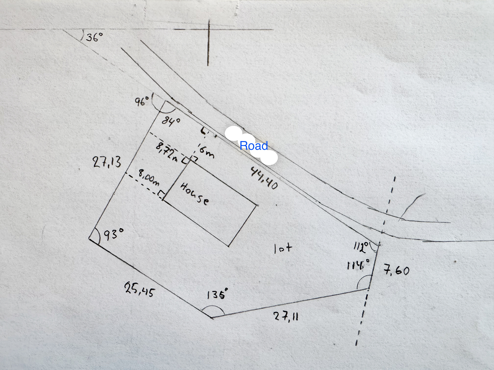
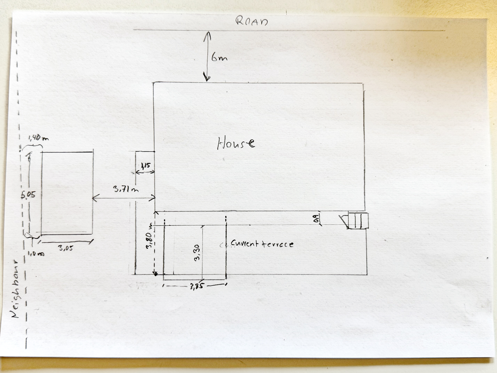
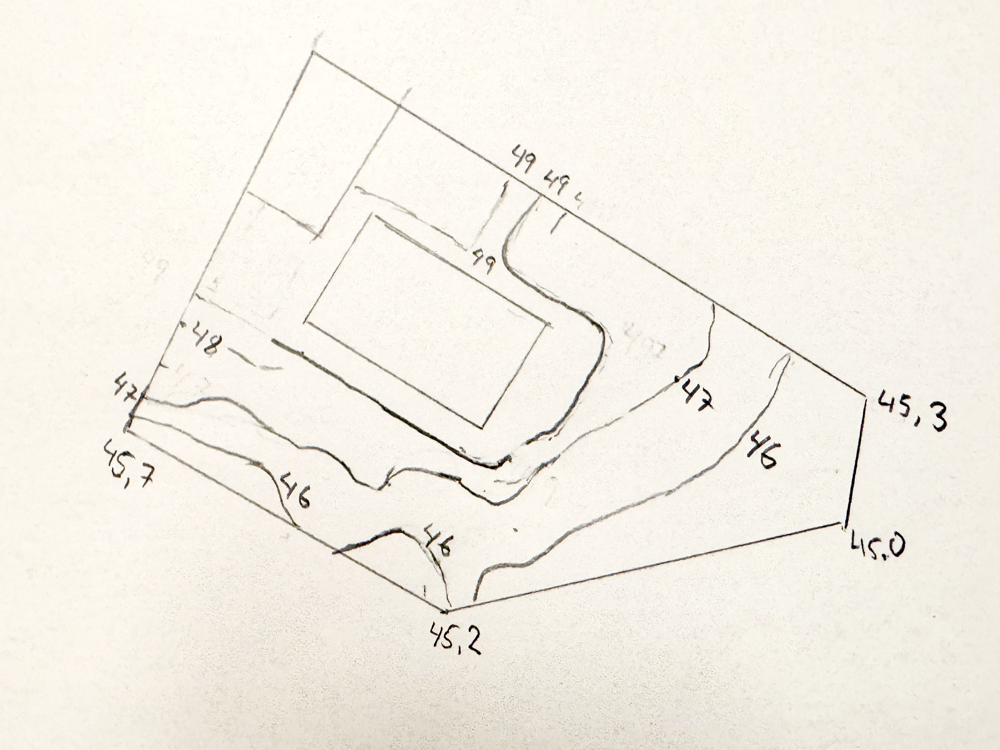

# My terrace (and driveway) redesign

As mentioned in the [README](README.md#your-base-design) getting that base design in place can be a process. What I found working was a combination of me drawing things on paper and the agent (Grok 4.5) using web services and APIs. To give the agent the ability to drive web apps I used [Epupp](https://github.com/PEZ/epupp).  

> [!NOTE]
> [Epupp](https://github.com/PEZ/epupp) is a web browser extension which makes the browser available at the REPL, in much the same way as we make Blender available in this project. I.e. it starts a REPL server in the web page and the agent connects to it and can then drive that tab.

I live in Sweden so there is https://minkarta.lantmateriet.se/ (and in Norway there is https://norgeskart.no/). This worked for me: I told the agent the name of my property and it started to poke around using the Epupp REPL. It found the lot boundaries and some more and drew things up in Blender. The agent then took initiative and started to look for more resources and found some API it used via the Babashka REPL to find elevation info, and it then used this to update the terrain in Blender. I then needed to update the terrain elevation data the agent had found with facts on the ground, using a manual process. 

Above I say that “this worked”, but it is not what I did at first. I started out much more manually. I actually started with tracing of a picture of my lot from an old construction map I have onto a sheet of paper. For this I used a makeshift light-table: Taping the construction map to a window during daylight and taping the sheet of paper on top and then I traced. (My youngest daughter suggested this when she saw me struggle without any light-table.)

> [!NOTE]
> Sorry for the rewind. I want to make clear that I actually know of a much more efficient way than the one I first used, and which is described below. Please note that also with the AI finding a lot of stuff online, the below manual processes still come in handy.

Still some more work needed before I could give this to the AI. The construction map had the road, the lot, and the house, plus elevation info. All from 1999.

What that old map didn't have was hard numbers on orientation of the lot. There are no angles and lengths of the polygon representing the lot. And some of the distances pertaining to the house were not there, or hard to read. I went out with my measuring tape to add hard distances to my drawing. I also measured the angles (somewhat inexactly) on my drawing, using a protractor, and augmented the drawing with those. The resulting drawing looks like so:

With that the AI quickly drew up the lot, the road and the house. I had the start of my base design. It was quite amazing how accurately it could read off my hand drawing and understand the implications.

Something was slightly off, though, and I told the AI that we needed a way to correct the lot boundaries and the road. I think because I had told the AI about my makeshift light-table, it used the REPL to place the image of my drawing in the design, rotated and scaled to fit. The image was placed just below the lot and the view was set to from above. The lot boundary was represented by a polygon on top of the drawing. The AI called this a light-table and taught me how to edit the polygon, so that I could adjust it to match my drawing. The AI then used the REPL to inspect the polygon and updated the terrain mesh. What amazing times to live in.

Now I had a more better base design.

However, since the house was built we have also built a small shed. And, of course, I had spent a summer building our current terrace with its canopy. I went out with my measuring tape again, since I couldn't find my old drawings from when I built the terrace. I also measured everything about the shed. Then sat down with my ruler and pen:

The agent took this, asked a few questions, and then added the structures to the base design. Just like that.

Great. In place: The property, road, house, shed, current driveway, current terrace. What was lacking was the terrain elevation. The agent had read some of it from the construction map and through our conversation, but we live on the hill and I can tell you that our lot looks nothing like flat juice with flat juice on top. The terrain elevation is super important for the project.

The construction map was too busy and outdated for the AI to be able to use it effectively. I spent a lot of tokens trying. Then I remembered the light-tables. So, taping a new sheet of paper to the map (still taped to the window). I traced off the relevant elevation lines, the lot and the house. Then I augmented with a combination of measured and eyeballed elevation info from what the property actually looks like. Result:

Handing this to the AI. It created its light-table in Blender with the elevation drawing and some lines on top, labeled after the elevation lines they should match. Then the agent taught me how to edit bezier lines in Blender and I traced each bezier to the elevation lines on my drawing. Then, BOOM, it updated the terrain mesh, and ...

... Bob's my uncle.

This was the story about how I created my base design. I hope to learn many stories about different, and better, ways to do it. I challenge you to have more fun than I had, though!