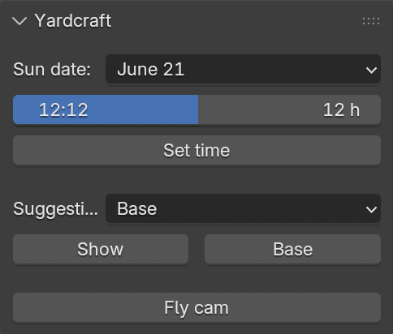

# Yardcraft

> [!NOTE]
> **WIP**! Come back tomorrow and this may be ready to take for a spin.

A recipe for letting your AI Agent of choice help you design your yard, patio, parking, swimmingpool, etcetera in [Blender](https://www.blender.org/). 


Your ideas can be rendered and iterated on solely in memory (in the REPL as we Clojurians say) without updating any files. When you're happy, the design is persisted as data and code (but I am repeating myself) in the project. You can also create custom UI in Blender in the REPL and iterate on it before persisting to files in the project.

YouTube: [Yardcraft: Redesigning my terrace w/ Calva + Blender + Basilisp + Grok](https://www.youtube.com/watch?v=_JDSeMP8RhE)

## How it works

Blender is driven live by you and the AI agent using [Basilisp](https://github.com/basilisp-lang/basilisp) (Clojure on Python) over nREPL using [basilisp-blender](https://github.com/ikappaki/basilisp-blender). 

This recipe is provided to you as this project, and you then use your AI Agent as your guide and doer to set things up. Once you have things set up, you enter genie mode and can throw your ideas at the agent which carries them out and maintains the project for you. True vibe designing.

## Prerequisites

* Git

The agent will help you get everything else in place. (If you don't have Git, the agent can help you with that too, of course.)

## Getting started

1. On [github.com/PEZ/yardcraft](https://github.com/PEZ/yardcraft), click **Use this template**
2. Clone your copy of the repo
3. Open the clone in your editor (the example below assumes **Cursor**).
4. Say **Hello** to your AI agent in a new chat. It takes things from there.

### Example chat

**Human:** Hello

**Agent:** Hello! Yardcraft is designing your yard (patio, parking, lawn, trees — whatever) in Blender with me as your AI pair. I build in Blender, you check the viewport in Blender, we save into this project when you're happy. Don't worry if you don't know Blender — I can guide you. How would you rate your Blender knowledge? **1** never used it → **5** expert.

**Human:** 2

**Agent:** Perfect. For some parts of the setup I can **do** it or only **give you instructions**. Which do you prefer?

**Human:** Do.

**Agent:** *...installs Calva and Calva Backseat Driver extensions...* Editor tooling is in place. Next we need to install latest Blender. Please install it from https://www.blender.org/download/ and tell me when it's done.

**Human:** Blender installed!

**Agent:** We need to install basilisp-blender, an extension that both makes Blender scriptable via interactive programming (a super dynamic kind of programming) and gives us (you and me) a connection to the Blender runtime environment. I will install the right version, but I see that Blender is still running after you tested that it starts. Please close it.

**Human:** Blender closed!

**Agent:** *...installs the basilisp-blender extension in Blender...* Extension installed, now we need to start its nREPL server so that I can drive Blender. Please start Blender again and open the **Output Properties** tab (printer icon) and find the **Basilisp nREPL server** panel. Set the project path to this project folder, then click **START SERVER**. Tell me when it's running.


**Human:** Server running.

**Agent:** Next step is to connect me to the Blender nREPL server. In Cursor issue the command: **Calva: Connect to a running REPL server in the project**. Then select **basilisp-blender** in the **Project Type** menu.

**Human:** Done, I see a green **basilisp-blender** indicator in the status bar.

**Agent:** ⚡️ That means we are connected. Let me test the REPL. You should see an empty site in Blender — just the stage, no house or lot yet. I'll put something more fun there. Watch in Blender or here...

... The agent hammers on the REPL ...

What do you see now?

**Human:** I see **YARDCRAFT** in perspective, with some furniture on. And... I think a sundial ... And it's like I am flying around it in a circle, with the design always centered in the view. I also see a **Yardcraft** UI panel with some widgets.

**Agent:** Sweet. The UI should have a time-of-day slider you can use to see the change in how the shadows fall (and thus the sundial showing the time). You can then click the **Set time** button to align the lounger chairs to face the sun.

**Human:** Yeah, totally works!

**Agent**: You can exit the fly-cam mode by zooming or panning in Blender. To enable it again, click the **Fly Cam** button.

**Human:** Great. Now what?

**Agent:** Now I will need to ask you for information and material so that we can get the base structure of your yard up to replace the demo design. Material such as maps and sketch over photos, and we will try to find information from the web and any open APIs to make the manual labor less. You can look at the [`EXAMPLE-COOKING.md`](EXAMPLE-COOKING.md) document to get an idea for what the process may look like. Or just jump straight in at the deep end, let me know when you are ready for the next step.

**Human:** Let's get cranking!

## Your base design

The setup chat above will look differently depending on a lot of things. You may be using something else than Cursor (I've heard such stories!), Blender could be installed. Maybe you rather do the setup steps yourself and just have the agent as a guide. And so on. But the differences up to here are nothing compared to what's ahead. So I will leave off here, you will figure it out and the LLMs of today are super handy when it comes to knowing abbout and finding out about different options.

You can read a bit on what process I found with my terrace redesign here: [`EXAMPLE-COOKING.md`](EXAMPLE-COOKING.md). And also you may want to have a watch: YouTube: [Yardcraft: Redesigning my terrace w/ Calva + Blender + Basilisp + Grok](https://www.youtube.com/watch?v=_JDSeMP8RhE) (Which doesn't cover base setup a ton, but there is at least a mention.)


## Custom UI

A super powerful feature of Blender is that it supports creating custom UI via scripting. You should leverage this, I think. This project comes with a small starter pack of widgets for the **Yardcraft** tab. (Press N with the design area active to open the design side bar, there you will find **Yardcraft**.)



This UI was vibe coded using interactive programming in the REPL, just like the design. That means that I asked the AI to create some UI for some thing and it used the REPL connection to Blender to make the UI appear, without editing any files in the project. There we could iterate on the UI, and when I was happy enough I told the AI so and it wired the updates into the files on disk.

A note here is that “happy enough” may mean I let some issues slip, because I could easier fix them myself in the data declaring the UI in the files. The REPL is not just for the AI. Striking the balance here can be tricky, but at least know that there is a balance to strike.

## Alternative designs

This recipe has preparations for a process of making a base design and then from there creating suggestions. And then the custom UI has a selector for the suggestions so that it is easy to switch between them. It works, but there are probably better approaches, because it is a bit brittle with when suggestions deviate from the base. (Then again, perhaps the AI can be convinced to maintain this with discipline.)

The prepared process is like so:

1. Ask the agent for a suggestion. E.g. "Give the swimmingpool an arch at the southeast end, with fullwidth stairs descending towards to bottom”.
2. The agent creates the suggestion in the REPL as well as adding it to the selector in the UI.
3. You verify what's done using the UI selector, and ask for changes until you are happy.
4. The agent persists the suggestion and the UI by updating the files in the project.

## Fly cam

In the [Yardcraft: Redesigning my terrace w/ Calva + Blender + Basilisp + Grok](https://www.youtube.com/watch?v=_JDSeMP8RhE) video on YouTube you can see an example of a fly tour. It took a surprisingly long time to create. I think I may have gone about it the wrong way, or it is just a limitation of the current top AI models that they have a hard time visualizing a 3D tour like that, making the communication lossy. Anyway, like with the suggestions, realizing when it is better to let the AI write the files and then edit them will save you time. The fly tour is very data driven, so you can tweak the tour design pretty easily.

## Quote plan

In theory you should be able to generate a “quote plan” from any design and suggestion at will by evaluating something like:

```clojure
(plan/write-quote-plan! (sug/effective-site site))
```

at the REPL (from [site.cljc](src/yardcraft/site.cljc)). In practice this is a bit quirky, but the AI can handle it so if you have some patience ask it to generate the plan for you instead.

The quote plan is a top-down view of the design, with lengths, areas, and angles are included, and materials hinted at. It's meant so that you can ask a contractor for a quote. If you're planning to do the work yourself, you can use it to source quotes and such. Probably you can ask the AI to create a calculator, even.

## Where to take it?

As should be obvious, this is totally open ended. A first thing some people may want to extend with is some way to juggle different properties in the same project. Others may want to use the general process to design complete other things, like PCBs, or whatever.

Wherever you take this, I hope you will consider writing about it and also send PRs to this template project.

As more people use this recipe we should be able to improve the skills and instructions to get quicker and more efficient help from the AI for less tokens. Please h

## Recipe content

- Example cook (maps → quote plan): [`EXAMPLE-COOKING.md`](EXAMPLE-COOKING.md)
- Site reading notes (human): [`site.md`](site.md)
- Agent orientation / Setup: [`AGENTS.md`](AGENTS.md)
- Recipe package (skills, example images, helper scripts): [`recipe/`](recipe/)

## Licence

[MIT](LICENSE)

(Free to use and open source. 🍻🗽)
