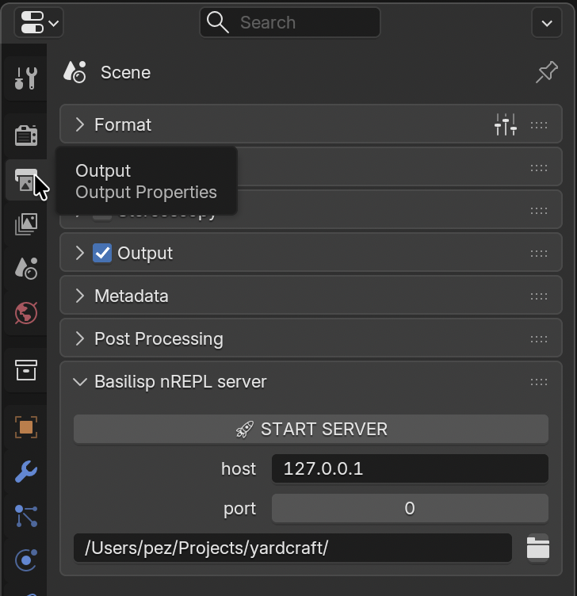

# nREPL and setup (basilisp-blender)

Upstream README: https://github.com/ikappaki/basilisp-blender

## Extension install (Blender ≥ 5.2.0 LTS)

**Agents / do-mode (CLI first):**

**Quit Blender completely before running `extension install-file`.**

1. Download `basilisp_blender_extension-<version>.zip` from releases
2. Install and enable from the shell:

```bash
blender --command extension install-file /path/to/basilisp_blender_extension-<version>.zip -r user_default -e
```

Find `blender` on `PATH`, or on macOS use `/Applications/Blender.app/Contents/MacOS/Blender` when the binary is not on `PATH`. Full steps and PEZ asset URL: [upgrade-basilisp.md](upgrade-basilisp.md).

**Fallback (human UI):** `Edit → Preferences → Get Extensions → Install From Disk…`, then enable **Basilisp Blender Extension** under Add-ons — only when the CLI is missing or `install-file` fails.

**Yardcraft default:** install the [PEZ zip bundling Basilisp 0.5.1](https://github.com/PEZ/basilisp-blender/releases/tag/v0.5.0-basilisp-0.5.1) (temporary until [ikappaki/basilisp-blender#14](https://github.com/ikappaki/basilisp-blender/pull/14)). Quit Blender before CLI install. See [upgrade-basilisp.md](upgrade-basilisp.md).

## Control panel

Properties editor → **Output Properties** tab (printer icon) → **Basilisp nREPL server** panel:

- Set **Basilisp Project Directory** to this repo root (Yardcraft)
- Click **START SERVER** (stop when needed)
- Bind host + port as needed

Serving state writes/updates `.nrepl-port` in that directory.

 — screenshot at `recipe/readme/images/basilisp-blender-nrepl-panel.png`.

## Editor connect

- **Calva (generic):** Command Palette → *Calva: Connect to a Running REPL Server, in your project* → `basilisp`
- **Yardcraft:** use the **`basilisp-blender`** connect sequence (session key `basilisp-blender`); the sequence runs `user/init!` — re-run after Blender restart or if `src/` is missing from `sys.path` before requiring `yardcraft.*`
- **CIDER:** `cider-connect-clj` → localhost → project:port

Open `basilisp.edn` so Clojure features activate even though the runtime is Basilisp.

## Programmatic start (Python inside Blender)

```python
from basilisp_blender.nrepl import server_start

shutdown_fn = server_start(host="127.0.0.1", port=8889)
# or:
shutdown_fn = server_start(nrepl_port_filepath="/path/to/project/.nrepl-port")
```

Optional `interval_sec` (default `0.2`) controls how often the main-thread timer drains pending nREPL work.

### Basilisp API wrapper

```clojure
(require '[basilisp-blender.bpy-utils :as bb])

(def server
  (bb/nrepl-server-start {:port 0 :interval-sec 0.2}))

;; (:shutdown! server) when done
```

See [api.md](api.md).

## Eval without nREPL

```python
from basilisp_blender.eval import eval_str, eval_file, eval_editor

eval_str("(+ 1 2)")
eval_file("path/to/code.lpy")
eval_editor("<text-block-name>")
```

## Debugging

```python
import logging
from basilisp_blender import log_level_set

log_level_set(logging.DEBUG, filepath="bblender.log")
```
